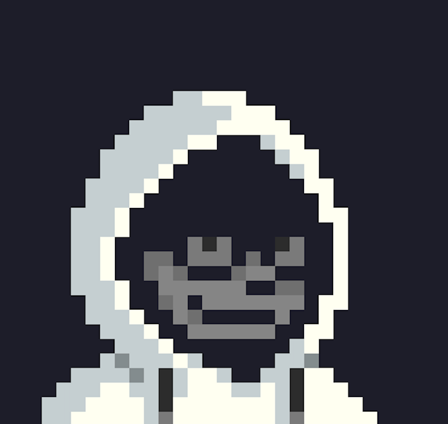

{:class="resized-image"}
# #WhoAmI 

_Donut_ is as a:
DevNet Engineer, Network Engineer and an Offensive Security Engineer based in the Philippines 🇵🇭. 

> What I do for a living: **Offensive Security, Ethical Hacking, Network Engineering, Automation, E-commerce**

> Outside of work: Your go-to meme guy! Holler if you see me around — I train 🏊🏽‍♂️🚴🏽🏃🏽🥊.

> ✝️ Isaiah 42:16

## Certifications

> **CCNA**: Cisco Certified Networking Associate

> **CCNP Enetrprise**: Cisco Certified Network Professional Enterprise

> Cisco Certified Specialist - Enterprise Wireless Implementation

> Cisco Certified Specialist - Enterprise Core

> ~~**OSCP** Offensive Security Certified Professional(In Progress 50%)~~

## Projects

> ~~To be updated: Building my Github repos~~

## Write Ups

> ~~To be updated: Creating my blogsite~~

## Write Ups
Need IT/Cybersecurity help? Shoot me an email, let’s talk about it! 💻

### E-mail & Socials 
_donut@donutskip.com_
[Instagram](https://www.instagram.com/donutskip/)
[Youtube](https://www.youtube.com/@donutskip)
[Facebook](https://www.facebook.com/profile.php?id=61566369599188)
[GitHub](https://github.com/donutskip)
